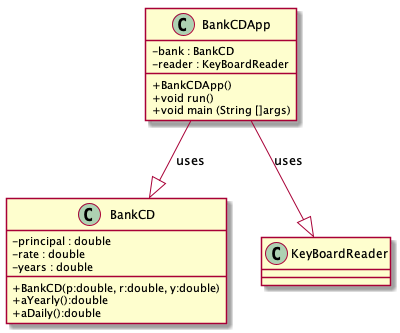
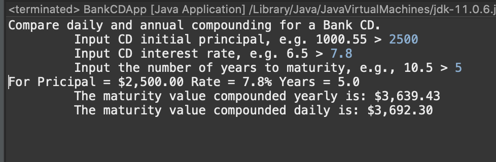

# Days in Month report
Author: Thien Nguyen

## UML class diagram
```
@startuml
skinparam classAttributeIconSize 0

class BankCD{
-principal : double
-rate : double
-years : double
+BankCD(p:double, r:double, y:double)
+aYearly():double
+aDaily():double
}

class BankCDApp{
-bank : BankCD
-reader : KeyBoardReader
+BankCDApp()
+void run()
+void main (String []args)
}
class KeyBoardReader{
}

BankCDApp --|> BankCD : uses
BankCDApp --|> KeyBoardReader: uses

@enduml
```



## Execution and Testing


