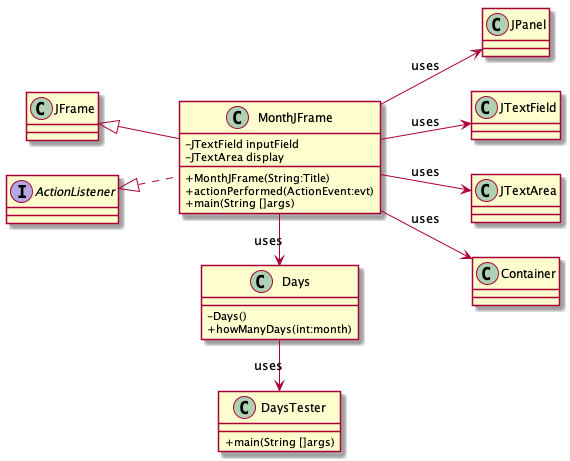
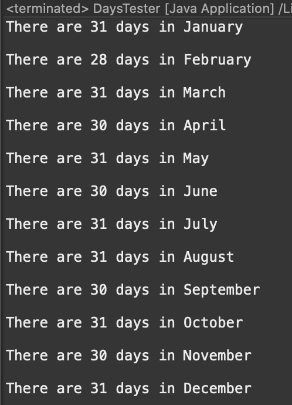
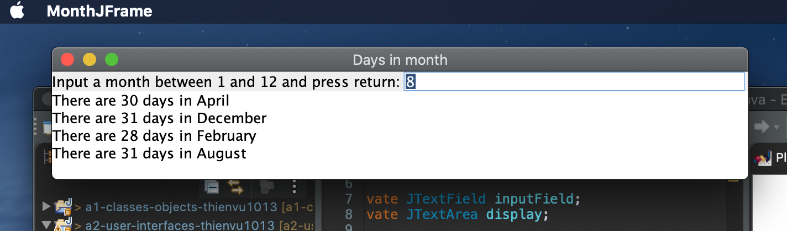

# Days in Month report
Author: Thien Nguyen

## UML class diagram
```

@startuml
left to right direction
skinparam classAttributeIconSize 0

class JFrame

class Days{
-Days()
+howManyDays(int:month)
}

class DaysTester{
+main(String []args)
}

interface ActionListener

class MonthJFrame{
-JTextField inputField
-JTextArea display

+MonthJFrame(String:Title)
+actionPerformed(ActionEvent:evt)
+main(String []args)
}

class JPanel

class JTextField

class JTextArea

class Container

class MonthJFrame extends JFrame
class MonthJFrame implements ActionListener
MonthJFrame -> Days : uses
Days -> DaysTester :uses
MonthJFrame --> JTextArea : uses
MonthJFrame --> JTextField : uses
MonthJFrame --> Container : uses
MonthJFrame --> JPanel : uses
@enduml

```



## Execution and Testing

**Testing `Days` class**

**Days in Month GUI Usage**


**App instructions:**
1. Launch the app by runing the program from Eclipse.
2. Next to the "Input a month between 1 and 12 and press return:", enter the desired month. This must be an integer.
3. Press enter. The result will be produced in the field below.
4. To exit out of he app, close the window and end the app through Eclipse console.

